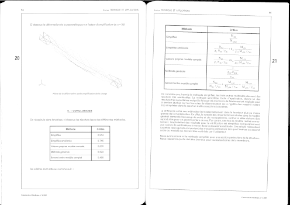
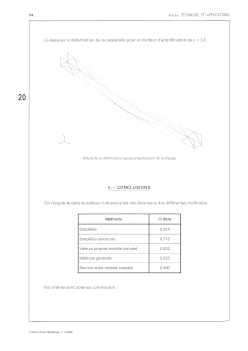
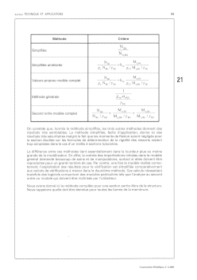

# ocr-book

## Goal

The goal of this project is to be able to convert

into these two pages :

 

The output is a PDF with final images with OCR behind the image.

## Progress

Now, the process can split pages in two, rotate each page, remove black border and save them to individual images.

## How to use it

Write all documentation at the same time that coding is hard. Some algorithms are too simply and I know they need to be improved.

You can have a look at the file `run_all.py` and simply run the command `execute(path_to_image)`

## It doesn't work with my image

No doubt about it. It still the beginning. Open a [issue](https://github.com/bansan85/ocr-book/issues) in github, send the image and tell what the problem. I will do my best to improve the recognition.

## How does it work ?

Open the file [algorithm.asciidoc](https://github.com/bansan85/ocr-book/blob/master/doc/algorithm.asciidoc) with the browser but remember that full algorithm is not detailed until they are stable.

